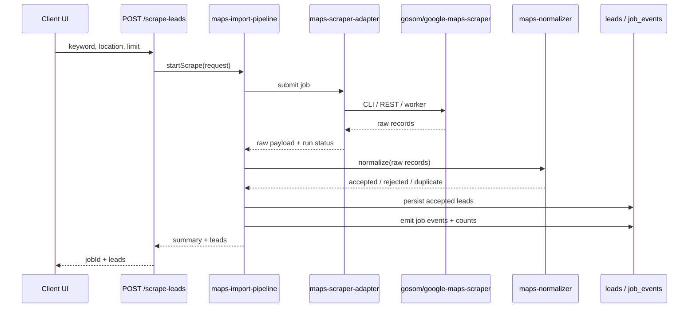

# Maps Scraper Interface Spec

## Purpose

Define a stable internal boundary between the app and `gosom/google-maps-scraper` so the product can change providers without rewriting route logic, lead normalization, or downstream workflows.

## Current Flow To Preserve

The current user path is:

`client/src/App.jsx` -> `POST /scrape-leads` -> `server/routes/leads.routes.js` -> `db.saveLeads()` -> `leads`, `campaigns`, `exports`, and `artifacts`.

The new ingestion layer must preserve:

- `POST /scrape-leads` as the entry point used by the UI.
- The response shape expected by the current client: `jobId` plus a `leads` array.
- Downstream consumers of the `leads` table, including `GET /leads`, `POST /analyze-leads`, `POST /export-leads`, `GET /export-my-leads`, campaign exports, and artifact generation.

## Boundary

The app must not call gosom directly from route handlers. All scraper interaction goes through three internal modules:

- `server/services/maps-scraper-adapter.js`
- `server/services/maps-normalizer.js`
- `server/services/maps-import-pipeline.js`

These modules are provider-agnostic at the route boundary. The route should know only that it can submit a scrape request and receive a run summary plus normalized leads.

## Recommended Provider Modes

The adapter must support these execution modes behind the same interface:

| Mode | Transport | Use case |
|---|---|---|
| `local-docker` | Shell out to `docker run` with gosom | Default for this repo. Docker is available locally, so this is the lowest-blast-radius path. |
| `external-rest` | HTTP to gosom web mode (`/api/v1/jobs`) | Best when the scraper runs on a dedicated VPS or shared scraper host. |
| `postgres-worker` | Producer/worker mode via PostgreSQL queue | Best for horizontal scale and long-running distributed jobs. |

Recommendation: use `local-docker` first, keep `external-rest` as the operational scale-up path, and keep `postgres-worker` for later if queue-based distributed scraping becomes necessary.

## Input Schema

### Internal Request

```ts
type MapsScrapeRequest = {
  requestId: string;
  userId: string;
  jobId: string;
  keyword: string;
  location?: string;
  limit: number;
  language?: string;
  emailExtraction?: boolean;
  extraReviews?: boolean;
  providerMode?: 'local-docker' | 'external-rest' | 'postgres-worker';
  source?: 'ui' | 'api' | 'backfill';
  traceId?: string;
};
```

### Expected Gosom Job Input

The adapter may translate the internal request into either:

- a gosom query file, or
- a REST job payload, or
- a producer record for distributed execution.

The adapter must not leak those provider details into route code.

## Raw Gosom Payload

The adapter must accept the actual upstream field names emitted by gosom. Representative fields include:

```json
{
  "title": "Example Plumbing",
  "address": "123 Main St, Kelowna, BC",
  "phone": "+1 250 555 0100",
  "web_site": "https://example.com",
  "review_rating": 4.7,
  "review_count": 128,
  "latitude": 49.888,
  "longtitude": -119.496,
  "cid": "1234567890123456789",
  "place_id": "ChIJ....",
  "emails": ["info@example.com"],
  "complete_address": "123 Main St, Kelowna, BC V1X 1X1, Canada",
  "link": "https://www.google.com/maps?cid=1234567890123456789"
}
```

Important: `longtitude` is the upstream field name. The normalizer must map it to `longitude` internally and never expose the typo outside the adapter boundary.

## Canonical Normalized Record

The normalizer must convert raw gosom output into a canonical lead record that is safe to persist and safe for downstream exports.

```ts
type NormalizedLead = {
  source: 'google-maps-scraper';
  name: string;
  address?: string;
  phone?: string;
  website?: string;
  rating?: number;
  reviews?: number;
  coordinates?: { lat: number; lng: number };
  placeId?: string;
  cid?: string;
  emails?: string[];
  mapsUrl?: string;
  completeAddress?: string;
  raw?: Record<string, unknown>;
  ingestStatus: 'accepted' | 'rejected' | 'duplicate' | 'partial';
  rejectReason?: string;
  sourceMetadata?: {
    providerMode: string;
    keyword: string;
    location?: string;
    requestId: string;
    jobId: string;
    scrapedAt: string;
  };
};
```

## Validation Rules

Validation happens before persistence.

- Accept a record only if it has a non-empty business name.
- Prefer `place_id` as the primary identity key.
- Fall back to `cid` if `place_id` is missing.
- Fall back to normalized website plus name plus address only when both IDs are absent.
- Normalize `web_site` to an absolute `https://` or `http://` URL.
- Normalize `review_rating` to a number in the range `0..5`.
- Normalize `review_count` to a non-negative integer.
- Convert `latitude`, `longtitude`, and other coordinate fields to numeric floats.
- Deduplicate `emails`, lowercase them, and strip invalid values.
- Prefer `complete_address` when `address` is missing or incomplete.
- Reject records that fail minimum identity requirements, and emit a structured rejection reason.

## Dedupe Rules

Dedupe must happen in two places:

1. Within the current scrape run.
2. Against already persisted leads for the same user.

Priority order:

1. `place_id`
2. `cid`
3. normalized `website`
4. normalized `name + address`

When two records collide, keep the richer record:

- prefer a record with `place_id`
- prefer a record with `website`
- prefer a record with more complete contact data
- prefer a record with non-empty coordinates
- prefer a record with more recent scrape metadata only when all other richness is equal

## Adapter Contract

### `maps-scraper-adapter.js`

```ts
type ScrapeStartResult = {
  runId: string;
  status: 'queued' | 'running' | 'staged' | 'imported' | 'failed' | 'partial';
  providerMode: 'local-docker' | 'external-rest' | 'postgres-worker';
};

type ScrapePollResult = {
  runId: string;
  status: 'running' | 'staged' | 'imported' | 'failed' | 'partial';
  rawCount: number;
  exitCode?: number;
  error?: string;
  artifactRef?: string;
};
```

Responsibilities:

- submit the job to gosom
- wait or poll until raw output is ready
- capture stderr, exit codes, and timeouts
- return a stable status object regardless of provider mode

### `maps-normalizer.js`

```ts
type NormalizeResult = {
  accepted: NormalizedLead[];
  rejected: { reason: string; raw: Record<string, unknown> }[];
  duplicates: { raw: Record<string, unknown>; dedupeKey: string }[];
};
```

Responsibilities:

- map upstream fields to canonical app fields
- validate and score record completeness
- compute dedupe keys
- preserve raw payload for replay/debugging

### `maps-import-pipeline.js`

```ts
type ImportSummary = {
  jobId: string;
  runId: string;
  requested: number;
  rawCount: number;
  normalizedCount: number;
  persistedCount: number;
  duplicateCount: number;
  rejectedCount: number;
  partialFailureCount: number;
  durationMs: number;
};
```

Responsibilities:

- orchestrate adapter submission
- normalize and validate raw records
- dedupe within-run and across historical leads
- persist accepted leads through the existing `db.saveLeads` contract or a compatible replacement
- emit job events and metrics for every phase

## Error Contract

Errors must be structured and distinguishable at the pipeline boundary.

```ts
type MapsScrapeError = {
  stage: 'submit' | 'poll' | 'parse' | 'normalize' | 'dedupe' | 'persist';
  code: string;
  message: string;
  retryable: boolean;
  providerMode: string;
  details?: Record<string, unknown>;
};
```

Rules:

- Retry transient submit/poll failures.
- Do not retry invalid payloads or failed validation.
- Return partial results when some records are rejected or deduped.
- Mark the run `partial` when some records succeeded and some failed.
- Mark the run `failed` only when the pipeline cannot produce any trusted records or the provider is unavailable.

## Observability Contract

Every run should emit:

- `scrape_started`
- `scrape_submitted`
- `scrape_polled`
- `scrape_staged`
- `scrape_normalized`
- `scrape_deduped`
- `scrape_persisted`
- `scrape_partial_failure`
- `scrape_failed`
- `scrape_completed`

Minimum event metadata:

- `jobId`
- `runId`
- `providerMode`
- `keyword`
- `location`
- `rawCount`
- `normalizedCount`
- `persistedCount`
- `duplicateCount`
- `rejectedCount`
- `durationMs`
- `errorCode`

## Compatibility Guarantees

- The UI may keep calling `POST /scrape-leads`.
- The route may still return `jobId` and `leads`.
- Existing consumers of `leads` must continue to see `name`, `address`, `phone`, `website`, `rating`, `reviews`, `placeId`, `tags`, and `createdAt`.
- Additional fields like `cid`, `emails`, `mapsUrl`, and `completeAddress` may be added, but must not break current payloads.

## Mermaid


