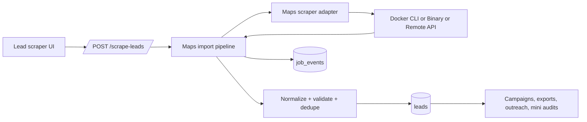

# Maps Scraper Interface Spec

## Purpose

Define a stable internal boundary between app logic and the upstream Google Maps scraper so the ingestion path can change providers without rewriting route, persistence, export, campaign, or artifact logic.

## Scope

This boundary is used by:

- `POST /scrape-leads`
- lead persistence in `server/services/db.js`
- downstream lead reads used by campaigns, exports, outreach, and mini audit generation

## Internal Contract

### Inbound request

```js
{
  query: 'plumbers in Austin, TX',
  limit: 25,
  language: 'en',
  depth: 1,
  concurrency: 1,
  includeEmails: false,
  fastMode: false,
  exitOnInactivity: '3m',
  timeoutMs: 180000
}
```

### Adapter response

```js
{
  provider: 'docker-cli' | 'binary-cli' | 'remote-api',
  version: 'gosom/google-maps-scraper:latest',
  providerJobId: 'optional-remote-job-id',
  results: [/* upstream raw rows */],
  diagnostics: {
    stderr: 'optional process stderr',
    statusResponse: {/* optional remote status payload */}
  }
}
```

### Normalized lead shape

```js
{
  name: 'Alpha Plumbing',
  address: '123 Main St, Austin, TX',
  phone: '+1 512-555-0100',
  email: 'hello@alphaplumbing.com',
  website: 'https://alphaplumbing.com/',
  rating: 4.8,
  reviews: 128,
  placeId: 'place-alpha',
  mapsUrl: 'https://maps.google.com/?cid=cid-alpha',
  coordinates: { lat: 30.2672, lng: -97.7431 },
  categories: ['Plumber'],
  source: 'google-maps-scraper',
  sourceMetadata: {
    query: 'plumbers in Austin, TX',
    cid: 'cid-alpha',
    dataId: 'optional',
    rawStatus: 'optional',
    mapsUrl: 'https://maps.google.com/?cid=cid-alpha',
    categories: ['Plumber']
  },
  dedupeKey: 'place:place-alpha'
}
```

## Validation Rules

- `name` is required.
- At least one of `placeId`, `website`, `phone`, or `address` must exist.
- `website` is normalized through the existing URL normalizer.
- `rating` must be numeric if present.
- `reviews` must be integer if present.
- Coordinates are dropped if either latitude or longitude is invalid.

## Dedupe Rules

- Primary key: `placeId`
- Secondary key: normalized `website`
- Fallback key: `name + address + phone`
- Collision policy: keep the richer record, measured by filled fields such as website, email, phone, reviews, rating, coordinates, and categories

## Persistence Rules

- Existing `place_id` matches are updated, not duplicated.
- Keyword tags are merged, not replaced.
- `source` is set to `google-maps-scraper`.
- `source_metadata` stores provider, provider job id, query, and selected upstream identifiers.
- `last_scraped_at` is refreshed on every successful import.

## Error Contract

Adapter errors are surfaced as typed failures:

- `maps_scraper_query_missing` -> `400`
- `maps_scraper_launch_failed` -> `503`
- `maps_scraper_provider_invalid` -> `503`
- `maps_scraper_timeout` -> `504`
- `maps_scraper_remote_*` -> `502`/`503`/`504`

Route behavior:

- Fail the job
- Log an error event
- Return `{ error }` with a meaningful HTTP status

Partial failures are not fatal if at least one normalized lead remains. Invalid rows and duplicate counts are logged to `job_events`.

## Provider Modes

### Default: local Docker CLI

- Runs `gosom/google-maps-scraper` as a one-shot process
- Lowest blast radius inside the existing server
- No new always-on infrastructure required

### Optional: local binary CLI

- Same contract as Docker mode
- Useful when the binary is preinstalled on a VPS

### Optional: remote API

- Uses gosom web/API mode on another VPS
- Good for isolation and independent scaling
- Should only be enabled through config, never hard-coded into route logic

## Configuration Surface

- `MAPS_SCRAPER_PROVIDER=docker|binary|remote`
- `MAPS_SCRAPER_DOCKER_IMAGE`
- `MAPS_SCRAPER_BINARY_PATH`
- `MAPS_SCRAPER_BASE_URL`
- `MAPS_SCRAPER_API_KEY`
- `MAPS_SCRAPER_CONCURRENCY`
- `MAPS_SCRAPER_DEPTH`
- `MAPS_SCRAPER_LANG`
- `MAPS_SCRAPER_EXIT_ON_INACTIVITY`
- `MAPS_SCRAPER_TIMEOUT_MS`
- `MAPS_SCRAPER_REMOTE_POLL_MS`
- `MAPS_SCRAPER_INCLUDE_EMAILS`
- `MAPS_SCRAPER_FAST_MODE`

## Data Flow


