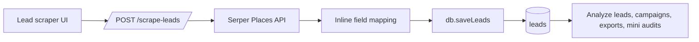
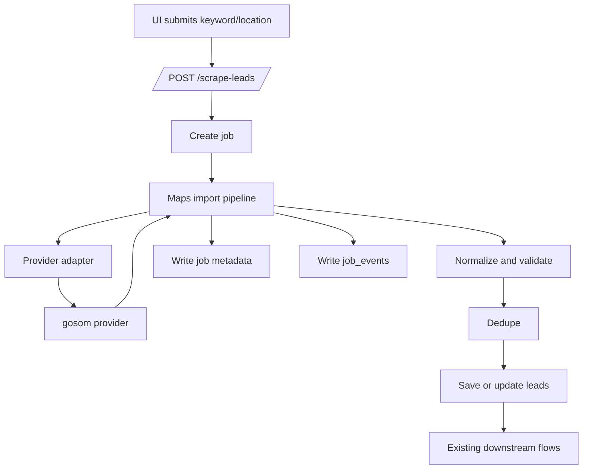

# Maps Scraper Migration Plan

## Objective

Replace the direct Serper-based Google Maps lead discovery route with a production-safe ingestion subsystem around `gosom/google-maps-scraper`, while preserving existing lead-generation workflows.

## Current State

Current path:

Weak points:

- Route logic is tightly coupled to one vendor response shape.
- Normalization and dedupe are implicit and shallow.
- Observability is limited.
- Partial failure handling is poor.

## Recommended Architecture

### Phase 1 recommendation

Use local Docker CLI mode as the default provider behind the new adapter boundary.

Why:

- Lowest blast radius
- No new persistent service to operate
- Works on the current VPS because Docker is already available
- Keeps the route synchronous, preserving current UI expectations

### Phase 2 option

Move the provider to gosom web/API mode on a separate VPS when volume, isolation, or scraping risk requires it. Keep the app boundary unchanged and switch only configuration.

## Target Flow

## Implementation Checklist

- [x] Add `maps-scraper-adapter.js`
- [x] Add `maps-normalizer.js`
- [x] Add `maps-import-pipeline.js`
- [x] Rewire `/scrape-leads` to the new pipeline
- [x] Add provider config to `server/config/env.js`
- [x] Add lead schema fields for email and ingestion metadata
- [x] Add normalization and pipeline tests with gosom-shaped fixtures
- [ ] Apply `supabase/migrations/006_maps_scraper_ingestion.sql`
- [ ] Set production env vars for the chosen provider
- [ ] Smoke-test `POST /scrape-leads` against a real query in the target environment
- [ ] Monitor duplicate rate and invalid row counts after rollout

## Observability Contract

Every scrape job should expose:

- provider name
- provider job id when remote
- raw row count
- normalized row count
- invalid row count
- duplicate row count
- saved lead count
- final job status

These are written through:

- `jobs.metadata.leadImport`
- `job_events`

## Operational Guidance

### Default runtime

- `MAPS_SCRAPER_PROVIDER=local-docker`
- `MAPS_SCRAPER_DOCKER_IMAGE=gosom/google-maps-scraper:latest`

### Remote runtime

- Run gosom in web/API mode on a separate VPS
- Set `MAPS_SCRAPER_PROVIDER=external-rest`
- Set `MAPS_SCRAPER_BASE_URL=https://<scraper-host>`
- Keep the app talking only to the internal adapter contract

### Risk controls

- Start with `MAPS_SCRAPER_INCLUDE_EMAILS=false` to reduce runtime and legal risk
- Keep concurrency conservative at first
- Keep a hard timeout
- Prefer one query per request until behavior is stable

## Legal and Compliance Notes

- Email extraction materially increases contact-data sensitivity and scraping footprint.
- Review Google Maps terms, local privacy rules, and outreach requirements before enabling broader collection or automated follow-up.
- Store only fields needed for business workflows and auditability.
- Keep provider switching at config level so the app can be paused or redirected without invasive code rollback.

## Rollout Plan

1. Apply migration `006_maps_scraper_ingestion.sql`.
2. Deploy code with `MAPS_SCRAPER_PROVIDER=local-docker`.
3. Run a low-volume smoke test.
4. Verify job metadata and `job_events`.
5. Verify leads still appear in the UI and can be analyzed/exported.
6. Observe duplicate and invalid ratios for the first production runs.
7. Only then consider enabling email extraction or moving to a remote provider.

## Rollback Plan

If gosom execution is unstable:

1. Set `MAPS_SCRAPER_PROVIDER` back to the last known-good option if one exists.
2. If necessary, revert the route and pipeline commit while leaving the schema migration in place.
3. Keep new nullable columns; they are backward-compatible.
4. Confirm `/scrape-leads`, exports, and campaigns still operate on existing leads.

Rollback is low-risk because:

- downstream lead readers still consume the same `leads` table
- new schema fields are additive
- provider choice is isolated behind one adapter
