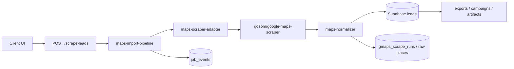

# Maps Scraper Migration Plan

## Goal

Replace the current brittle Serper-based lead discovery path with a stable ingestion subsystem built around `gosom/google-maps-scraper`, while preserving current lead generation, dedupe, export, and artifact workflows.

## Current State

The current path is:

`client/src/App.jsx` -> `POST /scrape-leads` -> `server/routes/leads.routes.js` -> `db.saveLeads()` -> `leads` -> `GET /leads`, `POST /analyze-leads`, exports, campaigns, artifacts.

The existing route directly calls Serper and maps raw fields inline. That is the failure point we are removing.

## Recommendation

Use a provider-agnostic internal ingestion boundary with a default `local-docker` provider.

### Why `local-docker` first

- Docker is available locally, so the provider is operationally feasible now.
- It isolates the upstream scraper from the app process.
- It keeps the initial blast radius small.
- It avoids coupling route code to gosom implementation details.

### Why not couple directly to gosom internals

- gosom exposes multiple execution modes.
- The app should not know whether the provider is using CLI, REST, or distributed jobs.
- Future provider swaps should require changes only in `maps-scraper-adapter.js`.

### Scale-up path

When local shell-out becomes too slow or too expensive, switch the adapter to `external-rest` or `postgres-worker` without changing route logic or normalization logic.

## Architecture

## Proposed Phases

### Phase 0: Baseline

- Document the current contract.
- Confirm current client response shape.
- Confirm downstream consumers still read from `leads`.

### Phase 1: Introduce the Boundary

- Add `maps-scraper-adapter.js`.
- Add `maps-normalizer.js`.
- Add `maps-import-pipeline.js`.
- Keep the route signature stable.
- Keep the existing `db.saveLeads` contract compatible.
- Add raw capture and structured event logging.

### Phase 2: Cut Over to gosom

- Switch the route from Serper to the new adapter.
- Use `local-docker` as the default provider.
- Preserve a feature flag or environment switch for the legacy path during rollout.

### Phase 3: Harden Operations

- Add metrics for run success rate, partial failure rate, duplicate rate, and normalization rejects.
- Add replay support from raw ingestion artifacts.
- Tune batch size, timeout, and retry policy.

### Phase 4: Optional Externalization

- If operational load grows, move the same adapter contract to a dedicated VPS-hosted gosom service.
- Keep route and normalizer code unchanged.

## Migration Checklist

- Add the new adapter, normalizer, and pipeline modules.
- Add environment configuration for provider mode and scraper endpoint.
- Add a migration for run/raw-record tracking if not already present.
- Preserve `POST /scrape-leads` response compatibility.
- Add observability events for each ingestion phase.
- Add fixtures for representative gosom payloads.
- Add regression tests for dedupe, normalization, and partial failure handling.
- Verify downstream consumers still work with normalized leads.
- Roll out behind a feature flag or provider switch.
- Keep the legacy path available until the new path is validated in production.

## Rollback Plan

Rollback must be configuration-first.

1. Switch the provider mode back to the legacy scraper path.
2. Stop sending new jobs to gosom.
3. Keep existing normalized leads and raw records.
4. Do not drop new tables or fields during rollback.
5. Review `job_events` and raw artifacts to understand the failure mode before reattempting cutover.

If the new path is already the default and needs to be disabled quickly, the route should fail over to a safe legacy provider setting rather than returning empty or partially corrupted leads.

## Operational Notes

- Use timeouts and bounded retries for every external call.
- Treat email extraction as optional because it increases runtime and failure surface.
- Treat `review_count`, `review_rating`, and coordinates as enrichment, not hard requirements.
- Keep raw payloads for replay and debugging, but avoid over-retaining unnecessary data.

## Practical Risk Notes

- Scraping may be subject to upstream terms, rate limits, and regional policy constraints.
- Avoid broad or indiscriminate collection.
- Log the keyword, location, and provider mode for every run.
- Limit concurrency and use backoff to reduce blocking risk.
- Maintain a clear source-of-truth field for `place_id` and `cid` so duplicate suppression remains deterministic.

## Acceptance Criteria

- The UI can still start a lead scrape from the same screen.
- A successful run returns normalized leads that can be exported and analyzed.
- Duplicate rates drop because the pipeline can dedupe before insert.
- Partial failures are visible in run status and logs rather than silently lost.
- If gosom fails, the run is marked clearly and the operator can see why.
